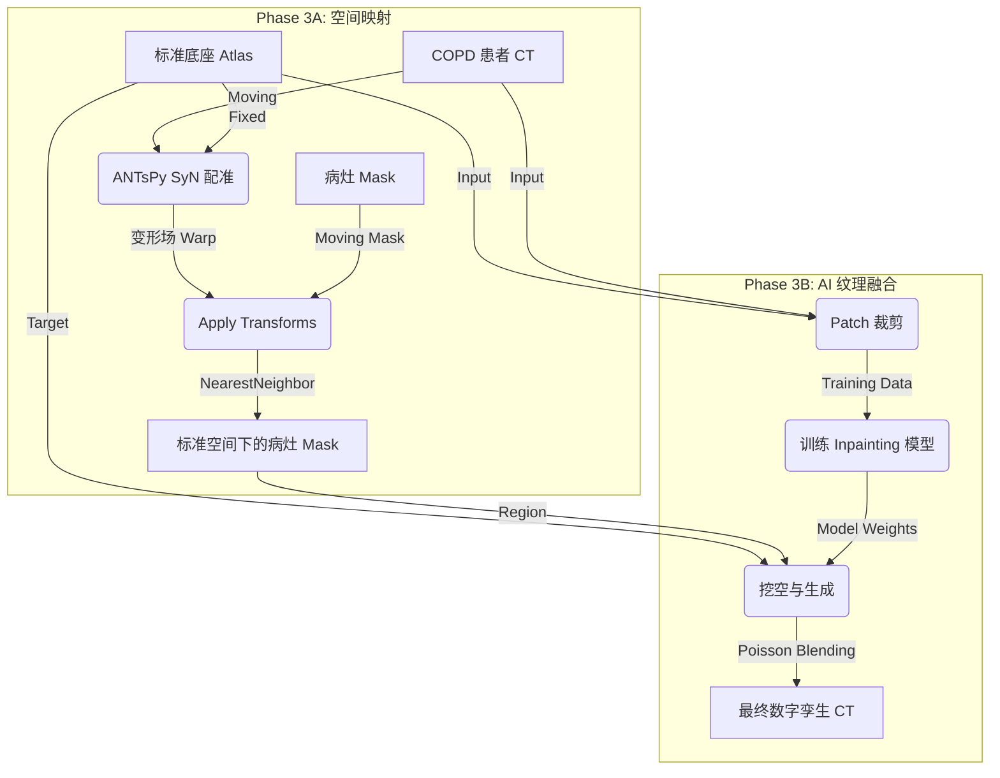

# Phase 3 实施指南：病理特征映射与 AI 融合

**课题名称**：基于全代码自动化的 COPD 数字孪生肺构建与 3D 可视化研究
**适用阶段**：Phase 3 (Pathology Mapping & Hybrid Fusion)
**核心范式**：宏观空间配准 (ANTsPy) + 微观纹理合成 (Generative AI)
**文档版本**：v1.1 (Based on Engineering Edition v6.3 & v5_1_Final.md)
**更新日期**：2025-12-30

---

## 1. 总体架构与逻辑

本阶段旨在解决"如何将真实的 COPD 病理特征逼真地迁移到标准数字孪生底座上"这一核心难题。

**核心逻辑**：

1. **宏观对齐 (Macro-Alignment)**：利用 **ANTsPy** 计算患者肺部到标准底座的变形场，将病灶 Mask 精确"搬运"到标准肺的正确解剖位置。
2. **微观缝合 (Micro-Synthesis)**：利用 **深度学习 (Inpainting/GAN)** 在标准肺的对应位置"挖空"并重新生成，修复因直接粘贴导致的边缘生硬和血管截断问题。

### 1.1 数据流图 (Data Flow)



---

## 2. 详细实施步骤 (Step-by-Step Implementation)

### 子阶段 3.1：宏观空间映射 (Macro Spatial Mapping)

**目标**：计算变形场，将 COPD 病灶 Mask 扭曲到标准底座空间。

| 项目 | 内容 |
|------|------|
| **对应脚本** | `src/03_registration/register_lesions.py` |
| **预计耗时** | 1-2 天（编写）+ 每例约 5-10 分钟（运行） |

**输入数据**：
- Fixed Image: `data/02_atlas/standard_template.nii.gz` (CT 模板)
- Fixed Mask: `data/02_atlas/standard_mask.nii.gz` (肺部 mask，用于约束)
- Moving Image: `data/01_cleaned/copd_clean/*.nii.gz` (患者 CT)
- Moving Mask: `data/01_cleaned/copd_emphysema/*.nii.gz` (病灶 mask)
- **数字肺底座** (可选): `data/02_atlas/digital_lung_labels.nii.gz` (融合标签，用于可视化)

> **注**: 数字肺底座将肺叶标签(1-5)和气管树(6)合并为单一文件，简化可视化流程。详见 [`docs/digital_lung_base.md`](digital_lung_base.md)

**技术细节**：
1. **配准算法**：使用 SyN (Symmetric Normalization)，微分同胚配准，保证大变形下的拓扑结构。
2. **插值策略**：
   - CT 图像：Linear 或 BSpline 插值
   - **病灶 Mask：必须使用 NearestNeighbor 或 GenericLabel**

**输出产物**：
- `data/03_mapped/{patient_id}/warped_lesion.nii.gz`
- `data/03_mapped/{patient_id}/warped_ct.nii.gz`
- `data/03_mapped/{patient_id}/transform*.mat`

---

### 子阶段 3.2：Patch 数据集构建 (Dataset Construction)

**目标**：从原始 CT 中提取训练用的图像块（Patch）。

| 项目 | 内容 |
|------|------|
| **对应脚本** | `src/04_texture_synthesis/dataset.py` |
| **预计耗时** | 3-5 天 |

**Patch 尺寸选择**：
- 推荐：64×64×64 体素
- 可选：128×128×128 体素（效果更好，显存需求更高）

**数据增强**：随机翻转、随机旋转、弹性变形、高斯噪声、强度缩放

---

### 子阶段 3.3：纹理生成网络训练 (Model Training)

**目标**：训练 Inpainting 模型。

| 项目 | 内容 |
|------|------|
| **对应脚本** | `src/04_texture_synthesis/train.py`, `network.py`, `losses.py` |
| **预计耗时** | 7-14 天（含调参） |

**模型架构选型**：
1. **基线方案**：3D U-Net Inpainting（推荐首选）
2. **进阶方案**：3D Partial Convolution Network
3. **高级方案**：3D Patch-GAN + Perceptual Loss

**损失函数**：L1 Loss + Perceptual Loss + Adversarial Loss（可选）

---

### 子阶段 3.4：推理与后处理

| 项目 | 内容 |
|------|------|
| **对应脚本** | `src/04_texture_synthesis/inference_fuse.py` |
| **预计耗时** | 2-3 天 |

**推理流程**：挖空 → 分块推理 → 拼接 → 泊松融合

**输出**：`data/04_final_viz/fused_copd_twin.nii.gz`

---

### 子阶段 3.5：效果评估与迭代

| 项目 | 内容 |
|------|------|
| **对应脚本** | `src/utils/metrics.py` |
| **预计耗时** | 3-5 天 |

**评估指标**：SSIM ≥ 0.85, PSNR ≥ 25 dB, 边界无明显断裂

---

## 3. 工程目录结构

```
src/
├── 03_registration/              # [Phase 3A] 空间映射
│   ├── __init__.py
│   ├── register_lesions.py
│   └── warp_utils.py
│
└── 04_texture_synthesis/         # [Phase 3B] AI 纹理融合
    ├── __init__.py
    ├── dataset.py
    ├── network.py
    ├── losses.py
    ├── train.py
    └── inference_fuse.py
```

---

## 4. 预计工期总览

| 子阶段 | 任务 | 预计耗时 |
|--------|------|----------|
| 3.1 | 宏观空间映射 | 1-2 天 |
| 3.2 | Patch 数据集构建 | 3-5 天 |
| 3.3 | 模型架构与训练 | 7-14 天 |
| 3.4 | 推理与后处理 | 2-3 天 |
| 3.5 | 效果评估与迭代 | 3-5 天 |
| **总计** | | **16-29 天** |

---

## 5. 下一步行动建议

### 立即执行

编写并运行 `src/03_registration/register_lesions.py`

- **原因**：只有先完成宏观空间映射，拿到 `warped_lesion.nii.gz`，后续 AI 融合才有目标区域。
- **验收标准**：病灶位置偏差 ≤ 5mm

### 依赖条件

| 前置条件 | 状态 |
|----------|------|
| Phase 2 标准底座 | ✅ 已完成 |
| 气管树模板 | ✅ 已完成 |
| 5 肺叶标签 | ✅ 已完成 |
| COPD 数据准备 | 🚧 待确认（需 30-50 例） |

---

## 6. 内存管理与故障排除

### 6.1 常见问题：内存分配失败

**症状**：
```
Exception caught:
itk::MemoryAllocationError (000000729D1E7650)
Location: "unknown"
File: ...\itkImportImageContainer.hxx
Line: 191
Description: Failed to allocate memory for image.
```

**原因**：
- ANTsPy SyN 配准需要大量内存（每例约 4-6 GB）
- 连续处理多个患者时，内存没有及时释放导致累积
- 系统可用内存不足

**解决方案**：

1. **自动内存清理**（已实现）：
   - `run_phase3_pipeline.py` 在每个患者配准后调用 `gc.collect()`
   - `register_lesions.py` 在配准函数内部释放大型对象

2. **降低配准参数**（可选）：
   修改 `config.yaml` 中的配准迭代次数：
   ```yaml
   lesion_registration:
     # 原始参数（高精度，高内存）
     # reg_iterations: [100, 70, 50, 20]

     # 降低后的参数（较低内存占用）
     reg_iterations: [50, 30, 20, 10]
   ```

3. **分批处理**：
   使用 `--limit` 参数分批处理患者：
   ```bash
   # 每批处理 10 例
   python run_phase3_pipeline.py --limit 10
   ```

4. **监控内存使用**：
   ```bash
   # Windows: 使用任务管理器监控 Python 进程内存
   # Linux: 使用 htop 或 free -h
   ```

### 6.2 配准参数调优

| 参数 | 默认值 | 低内存值 | 说明 |
|------|--------|----------|------|
| `reg_iterations` | [100, 70, 50, 20] | [50, 30, 20, 10] | 每级迭代次数 |
| `shrink_factors` | [8, 4, 2, 1] | [8, 4, 2, 1] | 多分辨率缩放 |
| `smoothing_sigmas` | [3, 2, 1, 0] | [3, 2, 1, 0] | 平滑参数 |

**注意**：降低 `reg_iterations` 会减少配准精度，但可显著降低内存占用和处理时间。

### 6.3 其他故障排除

| 问题 | 可能原因 | 解决方案 |
|------|----------|----------|
| 配准超时 | 图像尺寸过大 | 检查 CT 层数，考虑下采样 |
| 病灶丢失 | 插值方法错误 | 确保使用 `genericLabel` 插值 |
| 变形过大 | 患者与模板差异大 | 检查 CT 质量，考虑排除异常案例 |
