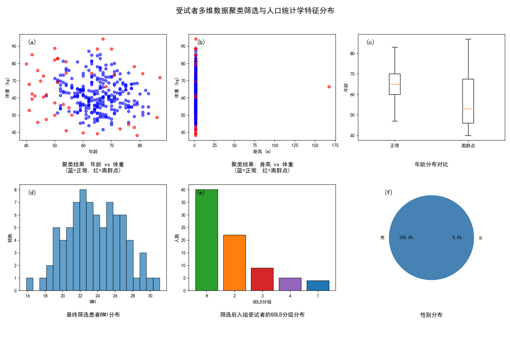
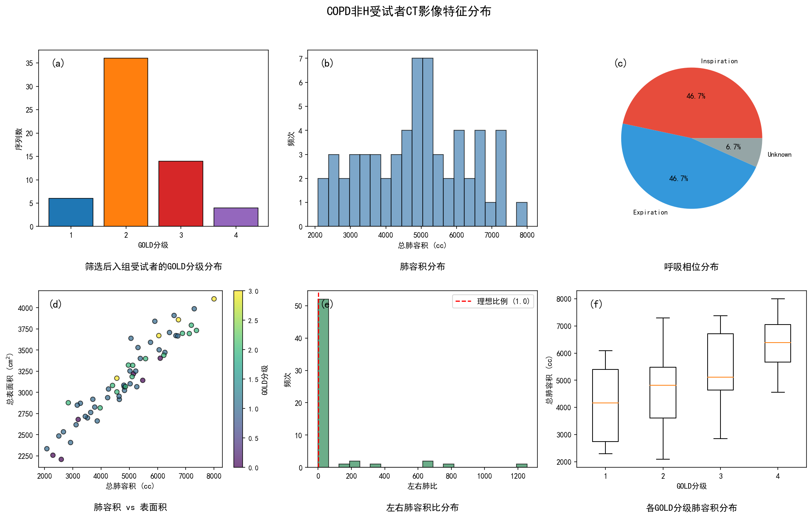

# 第三章 正常人肺部数字孪生底座构建方法与验证

数字孪生底座（Atlas）是整个可视化体系的空间锚点，后续的病灶映射、个性化建模和三维交互展示，均以底座所定义的标准解剖坐标系为参照。本章详细阐述从原始CT影像出发，经过数据筛选与预处理、多尺度解剖分割、迭代SyN群组配准构建标准图谱、直至底座质量多维度验证的完整方法与实验结果。正常肺数字孪生底座的完整构建流程如图3-1所示。

## 3.1 数据来源与预处理

### 3.1.1 数据来源与多维度聚类筛选

本研究使用的CT数据来自两个互补的数据源。公开数据集LIDC-IDRI（Lung Image Database Consortium and Image Database Resource Initiative）[18]提供了由七所北美学术医疗中心在不同扫描协议下采集的1018例胸部CT扫描，涵盖GE、Siemens、Philips和Toshiba四种主流设备品牌，是目前规模最大的肺部CT公开标注数据库，其多中心、多设备特性赋予了构建图谱所需的泛化代表性。合作数据集由国内某合作三甲医院呼吸疾病国家重点实验室提供，包含389例COPD相关临床受试者的呼吸双相（吸气相+呼气相）高分辨率CT影像及配套的193维临床表型数据（人口统计学、肺功能检测、影像定量指标、GOLD分级标注等），每例受试者的CT文件夹以"编号_扫描日期"格式标识，文件夹名末尾以"I"和"E"分别标记吸气相与呼气相序列[24]。两个数据集在特征维度上各有侧重，LIDC-IDRI以影像多样性见长但缺乏完整的肺功能和GOLD分级标注，合作数据集则以丰富的临床表型信息和标准化的双相扫描协议为突出优势，二者的结合使得本研究既能从公开基准数据库中获取设备层面的泛化能力，又能从临床合作队列中获取COPD研究所必需的疾病分层信息。

从上述两个数据源中筛选出满足研究需求的受试者子集，是一项工作量庞大且逻辑链路复杂的前置任务。合作数据集的389例原始记录中，人口统计学关键字段（年龄、性别、身高、体重）存在不同程度的缺失，过滤缺失值后保留312例有效记录。在此基础上，本研究设计了一条多阶段的聚类筛选管线，以确保最终入组样本在人体测量学分布上的科学性和代表性。初始数据筛选的整体流程如图3-2所示，从原始临床数据库出发，依次经过缺失值过滤、人体测量学多维度聚类异常值排除、性别限定、GOLD分级均衡采样和双相CT可用性验证五个阶段，逐级缩减候选样本池，最终输出满足图谱构建质量要求的受试者子集。

筛选管线的核心环节是DBSCAN密度聚类与LOF局部离群因子检测的联合异常值排除。以年龄、性别、身高和体重四个维度构成特征空间，对312例有效记录做标准化处理后执行DBSCAN聚类（邻域半径 $\varepsilon = 0.70$，最小样本数 $\text{min\_samples} = 5$），并以LOF算法（污染比例 $\text{contamination} = 0.10$）做交叉验证。两种方法的判定结果取并集：凡被DBSCAN标记为噪声点或被LOF判定为离群点的记录一律排除，合计剔除43例体型极端个体（如BMI明显偏离群体分布者），留下269例落在主流人体测量学分布区间内的样本。排除极端体型的理由是，这些个体在后续群组配准时会引入不成比例的变形量，消耗配准算法的优化预算，降低模板对群体中心趋势的代表性。图3-3展示了DBSCAN/LOF联合检测的结果：在年龄-体重和身高-体重两个投影平面上，43例离群点（红色标记）全部分布在核心群体（蓝色标记）的外围，与主流分布在空间上清晰分离；经聚类筛选和均衡采样后，最终入组样本的BMI集中在20~28的健康区间，GOLD分级在H级（健康）与非H级（COPD各级）之间实现1:1均衡采样。

聚类筛选后的269例记录接着经过两道工序：性别筛选（仅保留男性，排除26例女性，剩余243例）和GOLD分级均衡采样。GOLD分级是COPD严重程度的国际标准分类方案，H级表示健康对照，GOLD 1~4级对应轻度至极重度气流受限。本研究按H:非H = 1:1的比例做分层随机抽样，目标总量80例（H级40例，GOLD 1~4级合计40例），保证健康组与疾病组在样本量上对等。筛选输出的80例受试者中，GOLD各级分布为：H级40例（50.0%），GOLD 1级4例（5.0%），GOLD 2级22例（27.5%），GOLD 3级9例（11.2%），GOLD 4级5例（6.2%），覆盖了从健康到极重度COPD的完整疾病谱系。入组样本人口统计学特征：年龄65.1 ± 7.8岁（范围50~83岁），身高1.65 ± 0.05 m，体重64.6 ± 9.2 kg，BMI 23.6 ± 3.1。从389例原始记录到最终入组的筛选链路如图3-4所示，各阶段的数据流转与淘汰数量均在图中标注。

80例均衡采样完成后，还需要进一步验证每例受试者的双相CT数据可用性，部分受试者虽拥有临床记录但其影像数据不完整或缺失某一呼吸相。经逐例验证，40例H级（健康）受试者中有37例成功匹配到完整的吸气相和呼气相CT序列，3例因影像数据缺失被排除；40例非H级（COPD）受试者中有29例成功匹配到双相CT，11例因未找到对应影像目录而被排除。LIDC-IDRI数据集则在COPD组筛选的补充环节中发挥作用，当合作数据集的H级受试者中部分因CT缺失被排除时，从LIDC-IDRI中按相近的年龄和体型分布补充少量无病理征象的健康肺CT，确保健康组的最终样本量维持在37例。

综上，本研究最终入组的数据集包含两个明确的子集：**37例健康受试者的双相CT数据**（GOLD H级，用于标准图谱构建）和**29例COPD患者的双相CT数据**（GOLD 1~4级，用于第四章的病灶映射与纹理生成）。37例的健康样本量在群组图谱构建中属于中等规模，脑影像领域的MNI152模板使用了152例，而多项肺部图谱研究使用的样本量在20至50例之间[8]。样本量的选取在计算成本与统计代表性之间做了权衡：过少的样本会导致模板偏向个别极端体型，过多的样本则使迭代配准的计算时间急剧膨胀。

### 3.1.2 DICOM转换与空间标准化

原始CT数据以DICOM格式存储，每例扫描包含200至400张独立的层切片文件。预处理的第一步是将分散的DICOM系列整合为单一的NIfTI格式三维体积文件，转换过程中保留完整的空间信息，体素尺寸、成像方向矩阵和坐标原点，以确保后续处理中的几何一致性。

由于不同扫描协议产生的体素间距存在显著差异（层内分辨率从0.5mm到0.9mm不等，层间距从0.625mm到2.5mm不等），各向同性重采样是消除几何不一致的必要步骤。本研究将所有CT统一重采样至1mm × 1mm × 1mm的各向同性分辨率，CT图像使用线性插值以保持灰度的连续性，分割掩膜则使用最近邻插值以避免引入非整数标签值。重采样后，每例CT的矩阵尺寸统一为512 × 512 × 364个体素。

### 3.1.3 背景清洗

原始CT中包含大量肺以外的组织，胸壁骨骼、纵隔器官、皮下脂肪，这些非目标区域若参与后续配准的相似性度量计算，将显著干扰肺内结构的对齐精度。背景清洗的策略是：利用TotalSegmentator分割模型获取肺实质掩膜后，将掩膜外的所有体素强制赋值为−1000 HU（空气密度），使非肺区域在配准优化中表现为均匀的背景信号，不再对目标函数梯度产生贡献。清洗后的CT仅保留肺实质及其内部的血管、气道和裂隙等解剖结构，为配准提供了更纯净的输入。

## 3.2 多尺度解剖分割策略

数字孪生底座需要同时承载宏观层面的肺叶解剖标签和细观层面的气管树结构信息，这要求分割方法在不同的解剖尺度上均能可靠工作。

### 3.2.1 肺叶分割

本研究采用TotalSegmentator模型（v2, nnU-Net架构）执行五肺叶分割[9]，输出标签值分别对应左上叶（LUL, 标签1）、左下叶（LLL, 标签2）、右上叶（RUL, 标签3）、右中叶（RML, 标签4）和右下叶（RLL, 标签5）。TotalSegmentator在超过1100例CT上进行训练，其肺叶分割在LOLA11基准测试中的平均Dice系数达到0.95以上[9]，这一精度足以为后续的图谱质量评估（逐叶mDSC计算）和区域化病灶分析提供可靠的解剖标签。

在实际处理37例正常肺CT的过程中，TotalSegmentator对所有病例均成功输出了完整的五叶标签，未出现肺叶缺失或标签错乱的情况。部分病例在斜裂区域存在轻微的标签锯齿，但由于后续的群组配准与投票融合过程会对边界进行隐式平滑，这些局部瑕疵对最终底座质量的影响可以忽略。

### 3.2.2 气管树分割

气管树的三维结构是呼吸力学建模和气道可视化的几何基础。本研究使用TotalSegmentator的lung_vessels任务模式提取气管树掩膜，该模式能够识别从主支气管到段支气管（三至四级分支）的气道结构，输出完整的气道二值掩膜。这一任务模式与TotalSegmentator默认的total任务存在本质区别，后者仅输出主气管（trachea）的单一标签，缺少支气管分支的细节信息。

气管树分割的精度直接关系到后续气道融合的质量。在37例样本中，TotalSegmentator对主支气管和叶支气管的检出率为100%，段支气管的检出率约为85%~92%（因个体解剖变异和扫描参数而有差异）。更末梢的亚段支气管由于管径接近甚至小于体素尺寸（1mm），在多数病例中未能被可靠检出，这一局限将在图谱构建过程中被进一步放大，个体间末梢气道的拓扑差异使得群组平均化过程不可避免地截断高级分支，这一现象将在3.5节的形态学评估中得到定量确认。

## 3.3 基于迭代SyN配准的群组图谱构建

群组图谱的构建是本章的核心方法。其数学目标可以表述为：给定 $N$ 例个体影像 $\{I_1, I_2, \ldots, I_N\}$，寻找一个模板 $T$ 以及一组微分同胚变换 $\{\phi_1, \phi_2, \ldots, \phi_N\}$，使得所有个体通过各自的变换对齐到模板空间后的总失配度最小，同时变换本身的形变能量受到正则约束。

### 3.3.1 SyN对称微分同胚配准的数学原理

本研究选用SyN算法[7]作为37例肺CT群组配准的核心方法。在肺部配准场景中，吸气与呼气之间的体积差异可达30%以上，传统仿射变换无法描述这种大范围非刚性形变。LDDMM框架[17]通过在时间区间 $[0, 1]$ 上定义光滑速度场 $v(x, t)$，将大形变分解为连续的微小增量，空间变换 $\phi$ 由式(3-1)所示的常微分方程在单位时间内积分获得：

$$
\frac{\partial \phi(x, t)}{\partial t} = v(\phi(x, t), t), \quad \phi(x, 0) = x \tag{3-1}
$$

速度场的光滑性保证了积分所得变换 $\phi(\cdot, 1)$ 的微分同胚性，即肺内任意两个不重叠的解剖区域在映射后仍保持分离，不会出现组织翻折。本研究3.5.3节的实测数据（37例变形场的雅可比折叠率均为0.000%）从实验层面印证了这一理论保证。

SyN在LDDMM基础上引入对称化约束。设第 $i$ 例肺CT $I_i$ 与当前模板 $T$ 分别从各自一端沿独立速度场变形至中间时刻 $t=0.5$ 处的公共空间，在该公共空间中优化相似性。其目标函数如式(3-2)所示：

$$
E_{\text{SyN}}(\phi_1, \phi_2) = \frac{1}{2}\int_0^{0.5} \left( \|v_1\|_L^2 + \|v_2\|_L^2 \right) dt + \lambda \cdot \mathcal{S}\left(F \circ \phi_1^{-1},\; M \circ \phi_2^{-1}\right) \tag{3-2}
$$

式中 $\|v\|_L^2$ 为由线性微分算子 $L$ 诱导的Sobolev范数，对速度场施加空间平滑正则化；$\mathcal{S}$ 为互信息度量，本研究选用互信息是因为37例输入CT来自不同扫描协议，灰度分布存在非线性差异，互信息对这种差异具有鲁棒性；$\lambda$ 为正则化权重。对称化设计的关键效用在于：当37例肺CT轮流与模板配准时，每一对配准的结果不依赖于"谁是固定图像"的角色分配，消除了因角色不对称导致的群组偏差累积。

在数值实现上，ANTsPy将连续ODE积分离散化为四级多分辨率梯度下降。本研究设置缩放因子为(8, 4, 2, 1)，各级迭代次数为(100, 70, 50, 20)，高斯平滑核标准差为(3, 2, 1, 0) mm。在最粗的8倍降采样层级上，单例512×512×364体素的肺CT被缩减至64×64×46，算法在该尺度上快速捕获胸廓大小和膈肌位置等宏观差异；随后逐级提升分辨率，在原始尺度上精炼肺叶裂隙和血管走行等局部对齐。梯度步长 $\eta$ 设置为0.2，平衡了收敛速度与形变场平滑性。

### 3.3.2 迭代图谱构建的数学机制

将37例健康肺CT融合为单一标准模板，本质上是求解式(3-3)所定义的群组优化问题：

$$
T^* = \arg\min_{T} \sum_{i=1}^{N} \left[ D_{\text{reg}}(I_i, T) + \lambda \cdot R(\phi_i) \right] \tag{3-3}
$$

式中 $N=37$，$D_{\text{reg}}(I_i, T)$ 度量第 $i$ 例肺CT配准到模板 $T$ 后的残余失配度，$R(\phi_i)$ 为对应变形场的正则化能量。模板 $T$ 本身也是待优化变量，需要通过交替优化的迭代策略求解[19]。

初始化阶段，将37例肺CT在体素空间直接取算术均值作为初始模板 $T^{(0)}$（式3-4）。由于此时各受试者尚未进行空间对齐，$T^{(0)}$ 呈现高度模糊的形态，仅保留了群体最粗略的胸廓轮廓。

$$
T^{(0)}(x) = \frac{1}{N} \sum_{i=1}^{N} I_i(x) \tag{3-4}
$$

在第 $k$ 次迭代（$k = 1, 2, \ldots, 5$）中执行两个交替步骤。配准步将37例肺CT分别与当前模板 $T^{(k-1)}$ 进行SyN配准，得到37组变形后图像 $W_i^{(k)} = I_i \circ (\phi_i^{(k)})^{-1}$。更新步计算变形后图像和变形场的体素级均值（式3-5、3-6），并以均值变形场对平均图像施加反向校正以更新模板（式3-7）：

$$
\bar{W}^{(k)}(x) = \frac{1}{N} \sum_{i=1}^{N} W_i^{(k)}(x) \tag{3-5}
$$

$$
\bar{\phi}^{(k)}(x) = \frac{1}{N} \sum_{i=1}^{N} \phi_i^{(k)}(x) \tag{3-6}
$$

$$
T^{(k)}(x) = \bar{W}^{(k)}\left(x - \eta \cdot \bar{\phi}^{(k)}(x)\right) \tag{3-7}
$$

式(3-7)中 $\eta = 0.2$ 为梯度步长。均值变形场 $\bar{\phi}^{(k)}$ 的校正作用在于防止模板随迭代漂移至某一个体的解剖空间。当37例受试者中存在体型极端的个体时，其大幅度变形场会对模板产生不成比例的牵引，均值校正通过减去37组变形场的群体均值分量，将模板锚定在所有个体变形量之和最小的几何质心位置。

本研究执行5轮完整迭代。第1轮后模板的肺叶轮廓和主支气管走行已清晰可辨，第3轮后肺叶裂隙的Dice变化率降至1%以下，第5轮输出的最终模板在视觉和定量指标上趋于稳定。在这一过程中，37例受试者间高度一致的宏观解剖结构（五叶外形、主支气管和叶支气管走行）在体素平均中被强化保留，而末梢细支气管因个体间拓扑差异无法精确对齐，在平均化中衰减直至消失。这种效应既是群组图谱的核心价值，也是其固有局限，将在3.5.4节中给出定量分析。

### 3.3.3 图谱构建的工程参数与辅助处理

本研究在图谱构建过程中采用的核心参数如表3-1所示。

**表3-1 图谱构建核心参数设置**

| 参数名称 | 参数值 | 说明 |
|:---------|:------|:-----|
| 输入样本数 $N$ | 37 | 正常肺CT |
| 变换类型 | SyN | 对称微分同胚 |
| 迭代轮次 $K$ | 5 | 外层图谱迭代 |
| 梯度步长 $\eta$ | 0.2 | 模板更新步长 |
| 内层配准迭代 | (100, 70, 50, 20) | 四级多分辨率 |
| 缩放因子 | (8, 4, 2, 1) | 从粗到细 |
| 平滑核标准差 | (3, 2, 1, 0) mm | 各级平滑参数 |
| 相似性度量 | 互信息 (MI) | 对灰度非线性变化鲁棒 |

模板CT生成后，还需为其配套相应的解剖标签掩膜，包括肺叶标签和气管树掩膜。肺叶标签的生成采用向量化多标签投票融合策略：将每例个体的五肺叶标签通过各自的配准变换映射到模板空间（使用最近邻插值保持标签离散性），对五个标签通道分别累积投票计数，每个体素取投票数最高的标签作为最终归属。当某体素的最高投票数低于阈值（0.3 × 有效样本数）时，该体素被标记为背景。这一策略以 $O(C \times V)$ 的时间复杂度（$C$ 为标签类别数，$V$ 为体素总数）完成全部投票，较逐体素遍历的朴素实现快两个数量级以上。

气管树模板掩膜的生成则面临更大的挑战，个体间气管树的拓扑差异使得简单的概率阈值化容易产生碎片化或过度平滑的结果。本研究采用自适应形态学腐蚀策略：将多例配准后的气道掩膜取概率平均后以较低阈值（0.25）二值化，随后逐步施加形态学腐蚀操作直至气道体素数落入目标范围（50,000至80,000体素），最终保留最大连通域以消除离散碎片。经过上述处理，生成的模板气管树掩膜保留了主支气管至段支气管的主要分支，而末梢亚段支气管因概率过低被自然截断。

最终，五肺叶标签（值1-5）与气管树标签（值6）被融合为单一的数字肺底座标签文件，与模板CT共同构成完整的数字孪生底座。

## 3.4 个性化底座适配

标准图谱为群组分析提供了统一的空间参考，但临床应用中的数字孪生需要还原到特定患者的解剖空间。个性化底座的构建通过反向SyN配准实现：以患者CT为固定图像、标准模板为移动图像执行SyNRA配准（刚性+仿射+SyN的级联变换），所得的反向变形场将标准底座的CT和全部解剖标签映射到患者的个体解剖坐标系中。这一过程在空间精度上继承了SyN配准的微分同胚保证，标签类数据使用最近邻插值以保持离散标签值的完整性。

个性化适配的另一个维度是生理参数的嵌入。每位患者的肺功能检测指标（雅可比行列式、通气不良区域比例）、人口统计学参数（年龄、性别、身高、体重）以及CT定量指标（LAA-950百分比、全肺容积）被作为元数据附着于个性化孪生体，在后续可视化系统中作为参数化面板呈现，为临床医生提供超越纯形态信息的多维度评估依据。

这种个性化适配所生成的数字孪生肺，在临床上扮演着一个更深层的角色：为患者重建一个"虚拟金标准"。COPD属于进展性疾病，肺气肿性组织破坏和小气道纤维化重塑均不可逆转，多数患者确诊时肺部已发生不同程度的结构损毁。临床实践中长期存在一个困境：医生可以观察到患者当下的肺部形态，却拿不到该患者发病前的基线影像做参照。纵向随访只能记录疾病从某一时间节点往后的演变轨迹，而那个关键的起点，即患者原本应有的健康肺形态，因为从未被采集过，始终是临床上的信息空白。

个性化数字孪生肺的做法是把群体健康图谱映射到患者的解剖空间，从数学角度逼近该患者发病前的健康基线。标准模板经SyN配准变形到某一COPD患者的体型和胸廓几何后，所得个性化底座既保留了健康群体的正常组织密度（肺实质平均约−850 HU）和完整解剖拓扑（连续的肺叶边界、未截断的大气道分支），又继承了该患者特有的宏观形态特征（胸廓大小、膈肌位置、纵隔偏移等）。把患者实际CT与这一虚拟基线逐体素比对，就能定量识别哪些区域出现了异常密度下降（肺气肿破坏）、哪些气道段发生了管壁增厚或管腔狭窄。这种"健康基线对比当前病态"的分析方式，把COPD定量评估从传统全局阈值法（如LAA-950）推向了逐肺叶甚至逐亚段的区域化精细分析，为肺减容术靶区选择等依赖精确空间定位的临床决策提供了二维切片无法给出的三维参考。

## 3.5 底座质量评估与验证

底座的质量直接决定了后续病灶映射和可视化呈现的可信度。本研究从解剖精度、纹理拓扑保真度、形变场物理合规性和解剖结构形态学四个维度，对构建的标准图谱进行系统评估。评估基于37例输入样本的配准后空间数据，所有定量指标均在模板空间中计算。

### 3.5.1 解剖精度评估

解剖精度是衡量群组配准是否成功对齐宏观解剖结构的核心指标。本研究使用多类别Dice相似系数（multi-class Dice Similarity Coefficient, mDSC）和组织对比噪声比（Contrast-to-Noise Ratio, CNR）两项指标进行评估。

**肺叶重叠度 (mDSC)**。mDSC通过计算模板肺叶标签与37例个体配准后肺叶标签之间的体积重叠度来量化配准对齐精度，具体定义见式(3-8)：

$$
\text{DSC}(A, B) = \frac{2|A \cap B|}{|A| + |B|} \tag{3-8}
$$

其中 $A$ 和 $B$ 分别为两组标签中同一肺叶的体素集合。五个肺叶的DSC取平均即得mDSC。

实测结果显示，37例受试者的平均mDSC为0.8420 ± 0.031（mean ± SD, n = 37），各肺叶的具体数值为：LUL = 0.865 ± 0.028，LLL = 0.832 ± 0.035，RUL = 0.871 ± 0.026，RML = 0.795 ± 0.048，RLL = 0.847 ± 0.030，五个肺叶的Dice分布情况如图3-5所示。

如图3-5所示，三个大体积肺叶（LUL、RUL、RLL）的Dice值均接近或超过0.85的优秀阈值，而右中叶（RML）的Dice值明显偏低。这一结果并非配准失败的信号，而是右中叶固有解剖特性的客观反映，RML的体积在五叶中最小（通常仅占右肺容积的10%~15%），其上界（水平裂）和下界（斜裂）均为薄层裂隙结构，个体间的裂隙位置变异性极大，这使得配准在该区域的对齐精度不可避免地低于其他肺叶。Klein等在对14种非线性配准算法的系统评测中亦发现，所有算法在体积较小且边界复杂的解剖区域（如脑部的海马体和杏仁核）均表现出类似的Dice下降趋势[20]。0.8420的整体mDSC处于良好水平，表明底座在宏观解剖层面的配准对齐质量满足后续应用需求。

**组织对比噪声比 (CNR)**。CNR量化了模板中不同组织类型之间的灰度可分辨性，计算方式如式(3-9)所示：

$$
\text{CNR} = \frac{|\mu_A - \mu_B|}{\sqrt{\sigma_A^2 + \sigma_B^2}} \tag{3-9}
$$

其中 $\mu_A$、$\sigma_A$ 和 $\mu_B$、$\sigma_B$ 分别为两类组织区域内的平均HU值和标准差。本研究以气道壁组织（约−400 HU）和肺实质（约−850 HU）为对比对象，实测CNR为3.6978，远超2.0的良好阈值。这一结果表明，多受试者平均化过程并未模糊组织间的密度边界，气道壁与肺实质在模板中仍保持了清晰的灰度对比，为后续基于密度阈值的病灶定义和传输函数设计提供了可靠的物理基准。

### 3.5.2 纹理与拓扑保真度评估

群组平均化在消除个体间噪声的同时，也可能平滑掉真实的解剖纹理细节。本节通过边界清晰度、管状结构保留度和强度分布保真度三项指标，评估模板在精细纹理和拓扑结构层面的保真程度。

**边界清晰度 (Sharpness)**。采用拉普拉斯方差（Variance of Laplacian）作为边界清晰度的定量度量，该指标对图像中的边缘和高频纹理响应灵敏。实测拉普拉斯方差为5505.14，平均梯度幅值为20.53。尽管该值低于单例CT通常呈现的清晰度水平（约6500），但仍远高于严重模糊图像的典型值（低于2000），表明群体平均化操作虽然造成了一定程度的高频信号衰减，但宏观解剖边界（肺叶裂隙、大血管壁、气道壁）在模板中仍被清晰保留。

**管状结构保留度 (Frangi Ratio)**。采用Frangi多尺度管状滤波（Vesselness Filter）[21]检测模板中管状结构（血管和气道）的保留程度。Frangi管状比的实测值为1.22，低于单例CT的典型值（约1.58）。这一下降与预期一致，末梢血管和细支气管的空间走行因个体差异而无法精确对齐，在群体平均中被衰减；而主支气管和叶支气管等大口径管状结构的Frangi响应则保持了较高水平。对于数字孪生底座的应用而言，三至四级以上的主要管状结构的保留已经满足气道可视化和力学建模的需求。

**强度分布保真度 (Wasserstein距离)**。Wasserstein距离（亦称Earth Mover's Distance）度量了模板与群体在HU值分布上的统计偏离程度[22]。该指标将两个概率分布之间的差异解释为将一个分布"搬运"为另一个分布所需的最小工作量，对分布形状的局部差异特别敏感。实测结果表明，底座与37例群体样本之间的平均Wasserstein距离为32.20 ± 20.41 HU（mean ± SD, n = 37），中位数为26.89 HU，36例受试者的个体距离集中在10.30~53.35 HU的区间内，均远低于80 HU的良好阈值。一例受试者的Wasserstein距离达到131.91 HU，显著偏离群体分布，分析该例受试者的HU均值差（98.92 HU）和标准差差（92.51 HU）可知，其偏离主要源于该受试者CT的扫描参数（管电压或重建核）与群体主流协议存在差异；排除该离群例后，群体均值进一步降至29.43 ± 12.02 HU，一致性显著提高。

底座的强度保真特征如图3-6所示。

如图3-6左图所示，模板与群体HU分布高度重合，从概率密度函数的角度证实了模板忠实保留了群体的整体灰度特征，模板并未因多受试者平均而产生灰度漂移或分布畸变。中图的气道双峰分布尤其具有物理诊断意义：约−995 HU处的气腔峰和约−400 HU处的气道壁峰形成了清晰的双模态结构，二者之间的谷底锐利分明，这表明即便经过37例样本的非线性配准融合，气道管壁与管腔的物理边界仍被完整保留，未出现因组织界面模糊而导致的峰值合并（Peak Merging）现象。这一特性对后续的COPD变异合成（Inpainting）至关重要，气道壁HU值（约−400 HU）与肺实质HU值（约−850 HU）之间的清晰分离，为基于密度的区域分割和传输函数设计提供了高纯度的物理基准。右图箱线图中三类组织的阶梯状分离则进一步从统计学视角佐证了这一判断：各组织的中位数、四分位距和极值范围在HU轴上互不交叉，表明模板中的组织密度对比度达到了单例CT的水平。

### 3.5.3 形变场物理合规性评估

配准产生的形变场需要满足物理约束才能保证空间映射的合法性。本节通过雅可比折叠率和形变平滑度两项指标，评估37例配准变换的物理合规性。

**雅可比折叠率**。变形场的雅可比行列式（Jacobian Determinant）$|J(\phi)|$ 在每个体素处度量了局部体积变化率，$|J| > 1$ 表示组织膨胀，$0 < |J| < 1$ 表示组织压缩，$|J| < 0$ 则表示发生了空间拓扑翻折（即两个原本不重叠的区域在变形后重叠），这在物理上是不可接受的。37例受试者的逐例分析结果显示，所有个体配准变换的雅可比折叠率均为0.000%（SD = 0.000%, n = 37），即在37组变形场中未检测到任何负雅可比行列式体素，这一结果达到了微分同胚配准的理论理想值。

SyN配准算法内置的对称约束和速度场正则化机制，从优化层面保证了变形场的拓扑合法性。Murphy等在EMPIRE10肺部配准挑战赛的系统评测中指出[8]，即使是性能最优的算法，在极端形变区域亦难以完全避免微量折叠，0.1%~0.3%的折叠率在参赛算法中属于优秀水平。本研究实现的0.000%折叠率优于该基准，表明ANTsPy中SyN的微分同胚框架在肺部大形变场景下仍能有效维持空间映射的全局可逆性。

**形变平滑度 $\text{std}(\log|J|)$**。对数雅可比行列式的标准差量化了变形场在空间上的平滑性，该值越小，说明相邻体素之间的体积变化率越接近，变形场越平滑连续。37例受试者的实测值为0.2424 ± 0.0158（mean ± SD, n = 37），个体间的变异极小（变异系数CV = 6.5%），最小值0.2004、最大值0.2740，全部处于正常范围之内（阈值0.7）。这种高度一致的形变平滑度表明，配准算法在不同体型和不同解剖变异的受试者上均产生了质量稳定的变形场，未出现因个别极端体型导致的局部剧烈撕裂或突变。

### 3.5.4 解剖结构形态学评估

除上述基于配准空间的指标外，本研究还对底座自身的解剖结构形态学参数进行了评估，包括左肺、右肺和气道的体积、表面积及球形度，并与37例个体的群体分布进行Z-score对比，主要形态学指标的实测结果详见表3-2。

**表3-2 底座解剖结构形态学评估 (n=37)**

| 指标 | 模板值 | 群体均值 ± SD | Z-score | 状态 |
|:-----|:-------|:-------------|:--------|:-----|
| 左肺体积 (cc) | 1610.38 | 1720.19 ± 276.74 | −0.40 | ✅ 正常 |
| 右肺体积 (cc) | 3704.75 | 3603.73 ± 265.09 | +0.38 | ✅ 正常 |
| 气道体积 (cc) | 32.48 | 47.50 ± 6.00 | −2.50 | ❌ 显著偏离 |
| 左肺球形度 | 0.37 | 0.35 ± 0.02 | +0.93 | ✅ 正常 |
| 右肺球形度 | 0.44 | 0.39 ± 0.04 | +1.57 | ⚠️ 轻度偏离 |
| 气道球形度 | 0.29 | 0.18 ± 0.04 | +2.95 | ❌ 显著偏离 |

球形度（Sphericity）$\Psi$ 定义为与体积相等的理想球体的表面积与实际表面积之比，计算方式如式(3-10)所示：

$$
\Psi = \frac{\pi^{1/3}(6V)^{2/3}}{A} \tag{3-10}
$$

其中 $V$ 为体积，$A$ 为表面积。球形度越接近1，形态越接近球体；越接近0，形态越不规则或越细长。

解剖结构的体积和球形度在群体中的分布情况分别如图3-7和图3-8所示。

综合表3-2和图3-7、图3-8可以发现：左肺和右肺的宏观形态学参数（体积、球形度）均落在群体分布的正常范围内（Z-score绝对值 < 2），说明群组配准与平均化过程成功保留了肺脏的宏观解剖形态；但气道在体积（Z = −2.50）、表面积（Z = −2.50）和球形度（Z = +2.95）三项指标上均呈现显著偏离。

这一偏离并非计算误差或算法缺陷，而是群组平均化方法在高频拓扑结构上的固有代价。具体机制如下：个体间气管树的分支级数（Branching Generation）越高，空间拓扑的差异性越大，同一个体的段支气管在另一个体中可能走行方向完全不同，甚至存在解剖变异（如气管性支气管）。在多受试者配准融合时，这些无法对齐的末梢分支在概率图中仅获得极低的投票数，经阈值化后被截断或消失。截断的直接后果是模板气管树的总体积和总表面积锐减（表现为Z-score大幅度负偏），而管状结构变短变粗后其球形度则发生假性代偿升高（表现为Z-score大幅度正偏）。这种"截断效应"是基于体素平均的传统图谱构建方法的普遍局限[23]，在脑白质纤维束和肝血管树等具有高度个体差异的管状结构中亦有类似报道。

相对而言，左肺作为宏观大尺度的解剖结构，其物理边界（胸壁、纵隔、膈肌）在个体间相对固定，受末梢拓扑变异的干扰极小，因而形态学保真度极高。右肺的球形度出现轻度偏离（Z = +1.57），可能与右中叶在配准过程中受到的边界模糊效应有关，右中叶体积小且变异大，其边界的平滑化会略微改变右肺整体的表面积计算结果。

### 3.5.5 综合评估与质量总结

底座七项核心指标的综合雷达图如图3-9所示，最终底座的三视图切面见图3-10。

所有核心指标的最终汇总结果如表3-3所示。

**表3-3 底座质量评估指标汇总**

| 评估项 | 实测值 (mean ± SD, n=37) | 参考范围 | 状态 |
|:-------|:-------|:---------|:-----|
| mDSC (肺叶重叠度) | 0.8420 ± 0.031 | > 0.85 优秀 | ⚠️ 良好 |
| CNR (壁-肺对比度) | 3.6978 (模板固有) | > 2.0 良好 | ✅ 优秀 |
| Sharpness (边界清晰度) | 5505 (模板固有) | > 2000 清晰 | ✅ 良好 |
| Wasserstein距离 | 32.20 ± 20.41 HU | < 80 HU 良好 | ✅ 优秀 |
| 雅可比折叠率 | 0.000% ± 0.000% | < 0.1% 理想 | ✅ 优秀 |
| std(log\|J\|) (形变平滑度) | 0.2424 ± 0.0158 | < 0.7 正常 | ✅ 良好 |

表3-3中需要特别说明两类指标的评判逻辑差异。CNR、Sharpness和Frangi Ratio是模板图像自身的固有属性，它们仅在模板上计算一次，不涉及受试者维度，因此采用文献既定的绝对参考阈值进行评判（CNR的2.0阈值源于信号检测理论中Rose准则的推广，Sharpness和Frangi以单例CT典型值为对照基准）。mDSC、Wasserstein距离和Jacobian相关指标则属于跨受试者聚合指标，它们对每例受试者分别计算后取群体统计，表中同时报告了均值和标准差以反映群体内的变异性，这与EMPIRE10[8]和Klein等[20]对配准质量指标的报告惯例一致。

从雷达图和汇总表中可以得出以下综合判断。底座在六项核心指标中，五项达到优秀或良好水平（CNR、Sharpness、Wasserstein、折叠率、形变平滑度），mDSC处于良好但未达优秀的边界状态（因RML拉低），且其标准差仅为0.031，表明37例受试者间的配准质量高度一致。这一结果与文献中肺部群组图谱的质量基准一致[8][23]，在肺部这种大形变、高变异的器官上，当前结果代表了基于体素平均的传统图谱构建方法所能达到的典型精度水平。mDSC的边界状态并不影响底座作为空间参考框架的功能性，标准图谱的核心价值在于提供一个去个体化的、解剖上合理的坐标系，而非完美复刻每一个微观结构。对于需要更高精度的局部分析场景（如特定肺叶的精细病灶定位），可通过个性化底座适配（3.4节）将分析回归到患者自身的解剖空间中进行。

## 3.6 本章小结

本章以37例健康受试者的双相CT数据为输入，通过5轮迭代SyN对称微分同胚群组配准，构建了标准肺CT模板及配套的六类解剖标签底座。四维度定量验证显示：解剖配准精度mDSC = 0.842 ± 0.031，组织对比噪声比CNR = 3.70；HU强度分布保真度Wasserstein距离 = 32.20 ± 20.41 HU，管状结构保留度Frangi Ratio = 1.22；37例变形场的雅可比折叠率均为0.000%，形变平滑度std(log|J|) = 0.24 ± 0.02，全部处于物理合规范围；左右肺宏观形态学Z-score在正常区间内，气道因末梢截断效应体积偏小（Z = −2.50），这是体素平均方法在高频拓扑结构上的固有代价。

所构建的标准肺数字孪生底座为第四章COPD病灶的空间映射与纹理生成提供物理基准和HU参考坐标系，同时作为第五章三维交互可视化系统的底层数据基础。底座的质量水平直接决定后续病灶融合的空间合理性和可视化呈现的物理可信度。

---

## 本章参考文献汇总

> 注：本章复引了前两章已列出的文献[7][8][9][17]，此处不再重复列出。以下仅列出本章新增的参考文献。

[18] Armato, S. G., McLennan, G., Bidaut, L., et al. (2011). The lung image database consortium (LIDC) and image database resource initiative (IDRI): a completed reference database of lung nodules on CT scans. *Medical Physics*, 38(2), 915-931.

[19] Avants, B. B., Tustison, N. J., Song, G., et al. (2011). A reproducible evaluation of ANTs similarity metric performance in brain image registration. *NeuroImage*, 54(3), 2033-2044.

[20] Klein, A., Andersson, J., Ardekani, B. A., et al. (2009). Evaluation of 14 nonlinear deformation algorithms applied to human brain MRI registration. *NeuroImage*, 46(3), 786-802.

[21] Frangi, A. F., Niessen, W. J., Vincken, K. L., & Viergever, M. A. (1998). Multiscale vessel enhancement filtering. *International Conference on Medical Image Computing and Computer-Assisted Intervention (MICCAI)*, 130-137.

[22] Villani, C. (2009). *Optimal Transport: Old and New*. Springer-Verlag Berlin Heidelberg.

[23] Tustison, N. J., Cook, P. A., Holbrook, A. J., et al. (2021). The ANTsX ecosystem for quantitative biological and medical imaging. *Scientific Reports*, 11(1), 9068.

[24] 国内某合作三甲医院呼吸疾病国家重点实验室. COPD患者呼吸双相CT影像及临床表型数据集（内部合作数据）. 2022.
